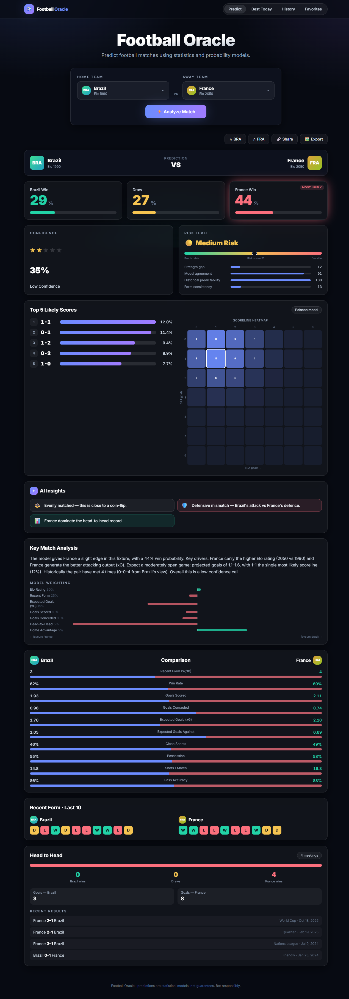

# ⚽ Football Oracle

> Predict football matches using statistics and probability models.

A premium, dark-mode football match prediction app for you and your friends. Pick two teams, hit **Analyze Match**, and get the six things that actually matter — **Win % · Draw % · Loss % · Confidence · Risk · Top-5 likely scores** — backed by a real Elo + weighted-factor + Poisson model, plus form, head-to-head, AI insights and an auto-generated match summary.

**It runs entirely in your browser.** The historical dataset is bundled and the whole prediction engine executes client-side — so there's **no backend to host**. Deploy the static site to GitHub Pages and it just works, for free.



---

## ✨ Features

- **World Cup 2026 simulator** — Monte Carlo simulates the entire tournament 10,000× from the real group draw: **title odds** (champion / final / semi / advance %), projected group standings, and a projected knockout bracket.
- **Match prediction** — three-way win/draw/loss probabilities from a weighted strength model.
- **Confidence score** — 0–100 + ⭐ rating + label (Low → Very High).
- **Risk meter** — 🟢/🟡/🔴 from strength gap, model agreement, historical predictability and form consistency.
- **Top-5 likely scores** — ranked list, probability bars and a full scoreline heatmap (Poisson).
- **AI insights** — auto-generated chips ("strong home advantage", "both teams to score", "upset warning"…).
- **Key match analysis** — a natural-language summary that always matches the numbers.
- **Team comparison** — form, goals, xG/xGA, clean sheets, win rate, possession, shots, pass accuracy.
- **Recent form** — last-10 W/D/L for both sides.
- **Head-to-head** — meetings, wins/draws, goals and recent results.
- **Best Predictions Today** — top-20 daily fixtures ranked by confidence.
- **Extras** — searchable team dropdowns, favorite teams, prediction history, export-as-image, shareable links — all persisted locally in your browser.

> Built on **real 2026 World Cup data**: the actual 48 qualified teams, the official group draw, current eloratings.net (June 2026) ratings, and each team's real recent form. Some granular stats are modelled from rating; head-to-head is synthetic. No live feeds, no logins, no servers.

---

## 🧱 Tech stack

| Layer    | Tech                                                        |
| -------- | ----------------------------------------------------------- |
| App      | React 18 · Vite · TypeScript · Tailwind CSS · Framer Motion |
| Engine   | Pure TypeScript — Elo + weighted model + Poisson, runs in-browser |
| Data     | Bundled JSON dataset (generated from a seeded SQLite toolkit) |
| Deploy   | GitHub Pages (static) · GitHub Actions · Docker (optional)  |

The `backend/` folder is an **optional dev toolkit** that generates the bundled dataset (seeded SQLite + an exporter). You never deploy it — it exists so the data is reproducible and so a real live-data API could be plugged in later.

---

## 📁 Project structure

```
football-oracle/
├── frontend/                      # ★ the entire app
│   ├── src/
│   │   ├── data/
│   │   │   ├── dataset.json        # bundled historical data (24 teams)
│   │   │   └── staticProvider.ts   # reads the dataset in-browser
│   │   ├── engine/                 # ★ the prediction engine (pure TS)
│   │   │   ├── elo.ts              # Elo ratings + expected score
│   │   │   ├── prediction.ts       # weighted factor model + goal rates
│   │   │   ├── poisson.ts          # Poisson scoreline matrix
│   │   │   ├── confidence.ts       # confidence scoring
│   │   │   ├── risk.ts             # risk scoring
│   │   │   ├── insights.ts         # rule-based AI insight chips
│   │   │   ├── summary.ts          # natural-language summary
│   │   │   ├── analyze.ts          # analyzeMatch() orchestrator
│   │   │   └── fixtures.ts         # deterministic daily slate
│   │   ├── api/client.ts           # runs the engine locally (swap-in seam for a real API)
│   │   ├── components/             # ResultView + all widgets
│   │   ├── pages/                  # Home, Best Today, History, Favorites
│   │   ├── lib/                    # format helpers + localStorage store
│   │   └── types.ts                # shared types
│   ├── Dockerfile + nginx.conf     # optional containerised static serve
│   └── vite.config.ts
├── backend/                       # OPTIONAL dataset toolkit (not deployed)
│   └── src/
│       ├── db/seed.ts              # deterministic seed generator
│       ├── engine/                 # original Node engine (mirrors frontend/engine)
│       └── scripts/export-dataset.ts  # writes frontend/src/data/dataset.json
├── .github/workflows/deploy-frontend.yml
├── docker-compose.yml             # optional
├── INSTALL.md
└── README.md
```

---

## 🧮 The prediction engine

The headline numbers come from **two independent models** that are then blended.

**1. Weighted strength model** — each factor produces a signal in `-1..1` (positive favours the home team); the weighted sum is the "home edge", mapped to win/draw/loss.

| Factor          | Weight |
| --------------- | ------ |
| Elo rating      | 30%    |
| Recent form     | 25%    |
| Expected goals  | 15%    |
| Goals scored    | 10%    |
| Goals conceded  | 10%    |
| Head-to-head    | 5%     |
| Home advantage  | 5%     |

- **Elo** uses the standard logistic expected score with a home-field bonus (`frontend/src/engine/elo.ts`).
- The home edge maps to outcomes via a draw rate that shrinks as the mismatch grows.

**2. Poisson scoreline model** — attack/defence profiles (blending goals + xG) become goal rates λ<sub>home</sub>, λ<sub>away</sub>, nudged by the strength edge. An independent bivariate Poisson grid (0-0…6-6, renormalised) yields every scoreline probability → sorted for the top-5 and the heatmap, and summed into its own win/draw/loss.

**Blend & derived metrics**

- Final outcome = `0.55 × strength model + 0.45 × Poisson`.
- **Confidence** rewards a clear favourite, a decisive edge, agreement between the two models, and stable form.
- **Risk** is the inverse of those predictability signals (strength gap, model agreement, H2H decisiveness, form consistency).
- **Insights** and **summary** are interpretable functions of these same quantities — so the words never contradict the numbers.

> The dataset is generated from a **fixed RNG seed**, so the same matchup always returns the same prediction.

---

## 🚀 Quick start

```bash
cd frontend
npm install
npm run dev          # → http://localhost:5173/football-oracle/
```

That's the whole app — no second process. Full details (incl. Windows/PowerShell) in **[INSTALL.md](INSTALL.md)**.

### Production preview

```bash
cd frontend
npm run build
npm run preview      # serves the built static site
```

### Docker (optional)

```bash
docker compose up --build   # static site on http://localhost:8080
```

---

## 🌐 Deployment — GitHub Pages

Automated via `.github/workflows/deploy-frontend.yml`:

1. Push to `main`. In **Settings → Pages**, set source to **GitHub Actions**.
2. Done — your site builds and deploys to `https://<user>.github.io/football-oracle/`.
3. If your repo isn't named `football-oracle`, set repo **variable** `VITE_BASE` to `"/<your-repo>/"`.

No secrets, no API URL, no backend.

---

## 🔄 Regenerating the dataset (optional)

The bundled `frontend/src/data/dataset.json` is committed, so you don't need this. To regenerate it (e.g. after tweaking the seed):

```bash
cd backend
npm install
npm run export:data   # rewrites frontend/src/data/dataset.json
```

### Future: real live data

Everything reads through one seam — `frontend/src/api/client.ts`. To use a real football API later, change those methods from "run the engine on the bundled data" to `fetch(...)` against your endpoint (you'd add a tiny backend or serverless proxy if the API needs a secret key). The UI doesn't change.

---

## ⚠️ Disclaimer

Predictions are statistical estimates from a model on historical seed data — not guarantees. For entertainment among friends. Bet responsibly.
